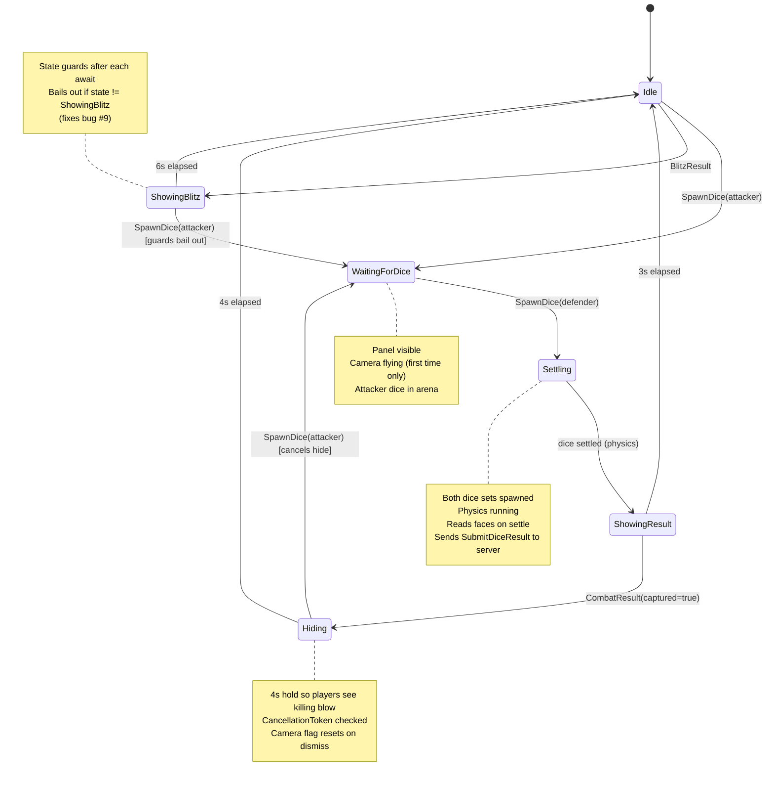
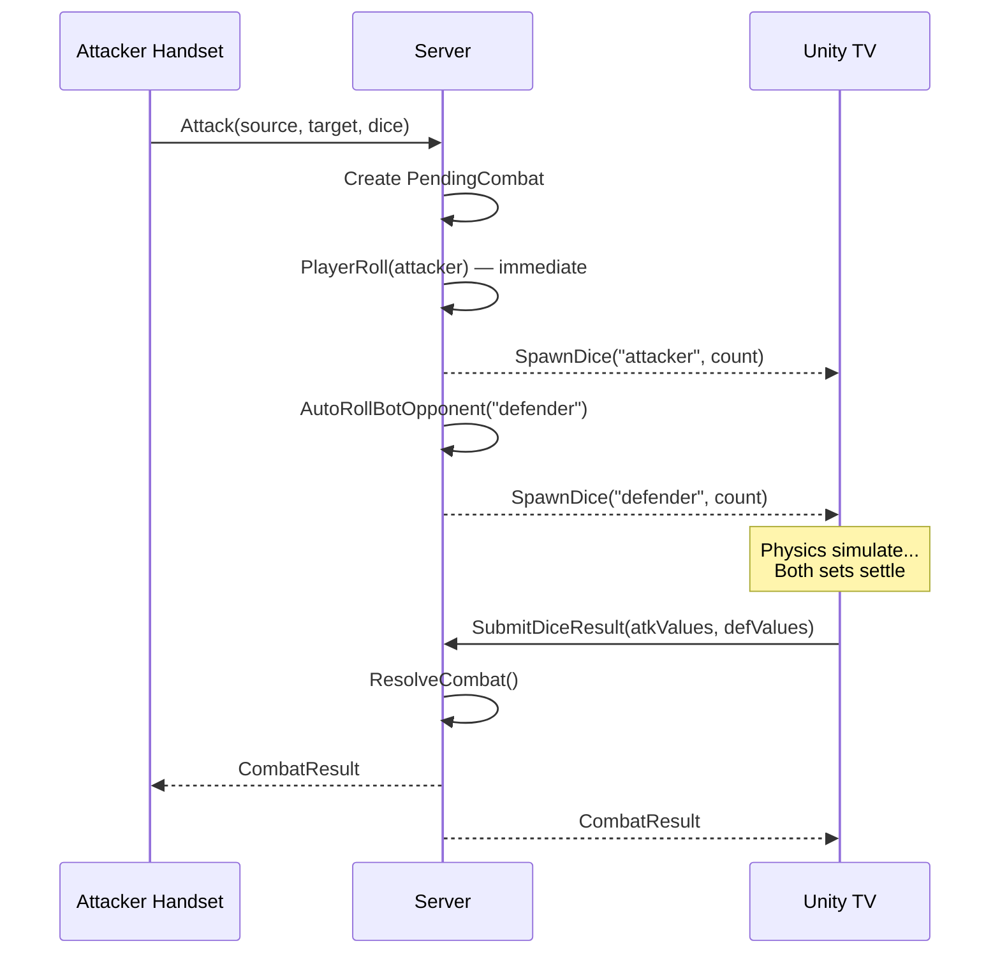
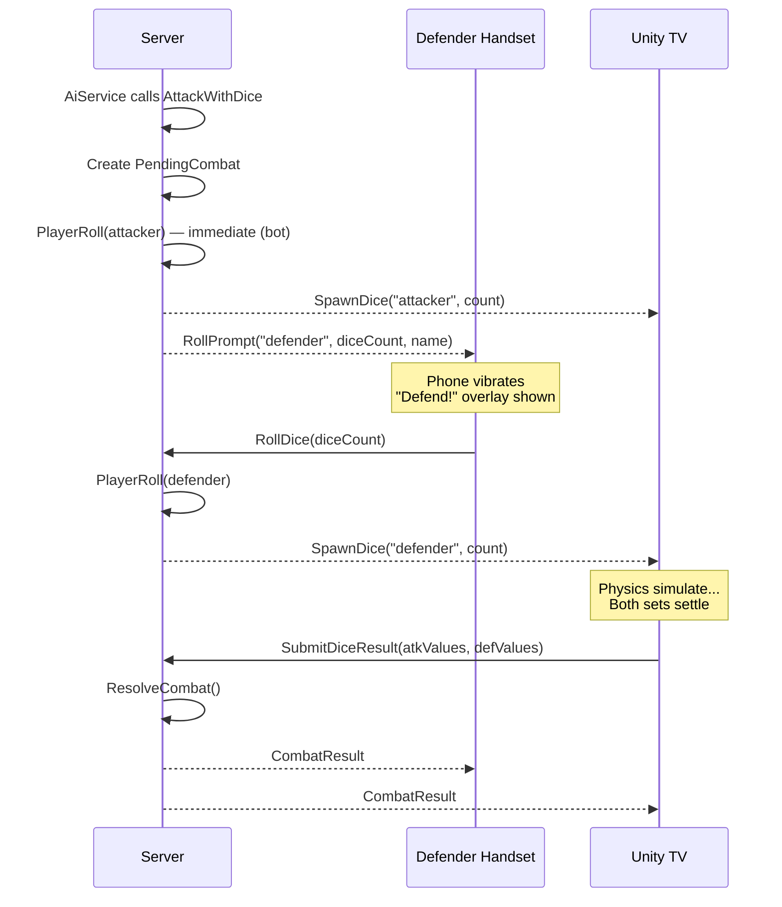
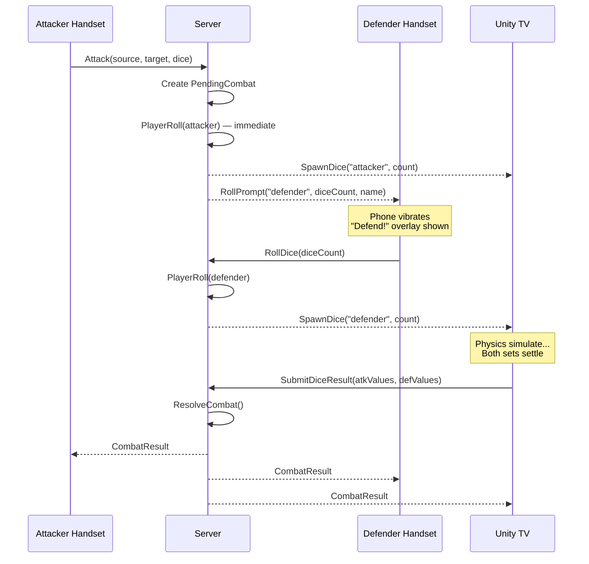
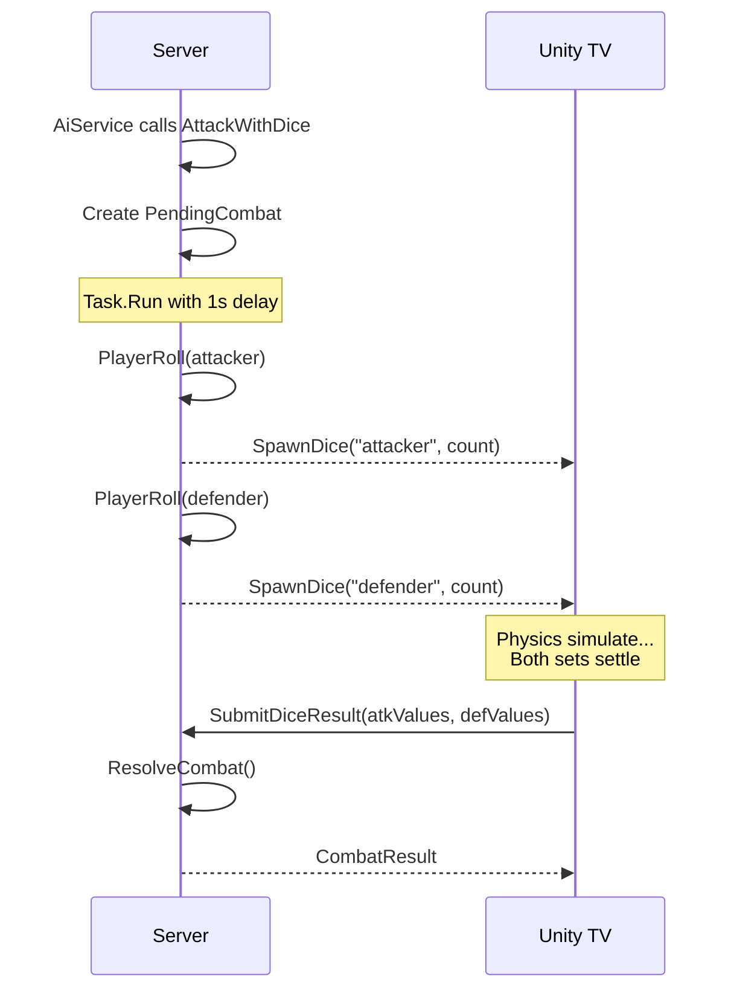
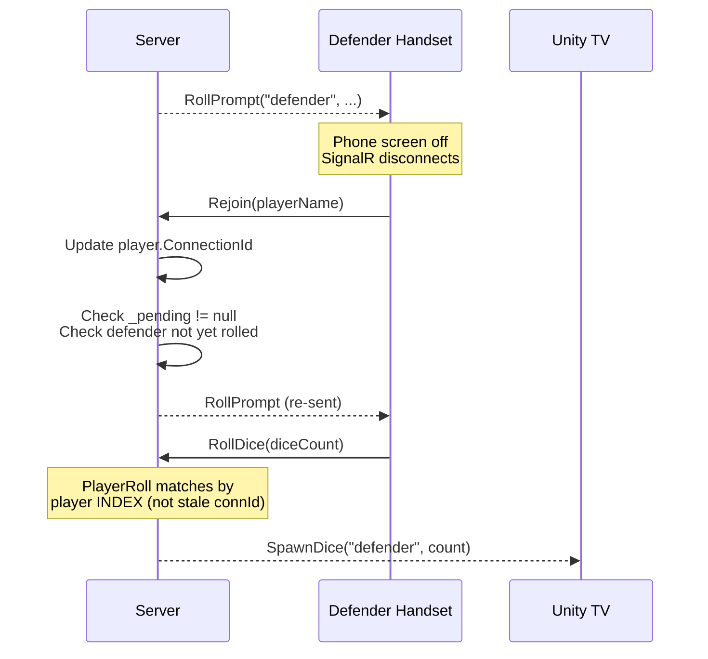
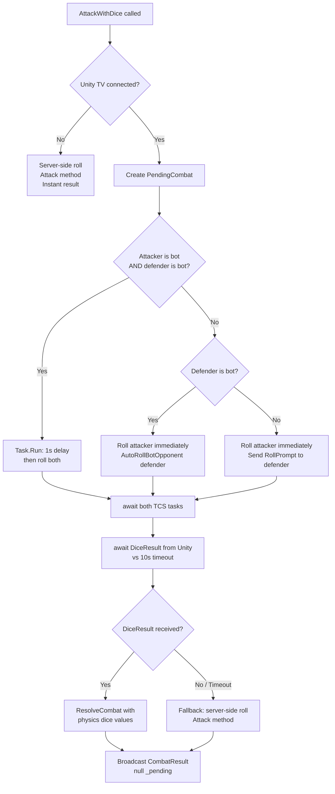

# Combat Flow — Visual Reference

Companion to [PROPOSAL-COMBAT-STATE-MACHINE.md](PROPOSAL-COMBAT-STATE-MACHINE.md) and [PROPOSAL-PLAYER-ROLLED-DICE.md](PROPOSAL-PLAYER-ROLLED-DICE.md).

---

## 1. Unity CombatTheatre — State Diagram

### Event Guards

| Event | Ignored when state is... | Reason |
|-------|--------------------------|--------|
| `CombatResult` | `WaitingForDice` | Stale result from previous combat |
| `OnStateChanged` (phase != Attack) | `WaitingForDice`, `Settling`, `Hiding` | Only cleans up in `Idle` or `ShowingResult` |
| `SpawnDice("attacker")` | *(never ignored)* | Always forces `WaitingForDice` — starts new combat |

---

## 2. Player-Rolled Dice — Sequence Diagrams

### Human attacks Bot

### Bot attacks Human

### Human attacks Human

### Bot attacks Bot

### Reconnect Recovery (Bug #8 fix)

---

## 3. AttackWithDice — Decision Flowchart

---

## Key Invariants

- **`_pending` is either null or represents ONE active combat.** Never two in flight.
- **Player indices are stable** — connection IDs change on reconnect, indices don't.
- **SpawnDice("attacker") always wins** — any async sequence (blitz display, hide countdown) must yield if a new combat starts.
- **No timeout on human defender roll** — humans roll when ready. Bots roll immediately.
- **Blitz stays server-side** — too many rounds for physics. Only final dice displayed statically on Unity.
- **10s timeout on Unity physics** — if SubmitDiceResult never arrives, server falls back to random roll.
