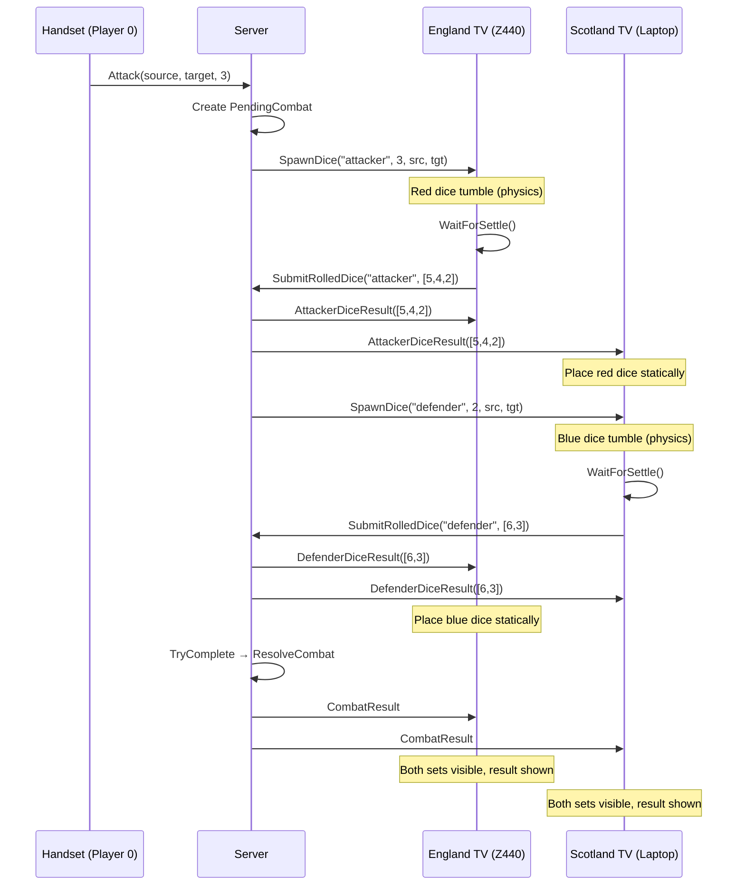
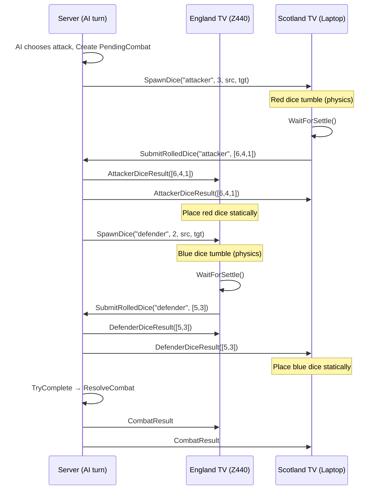
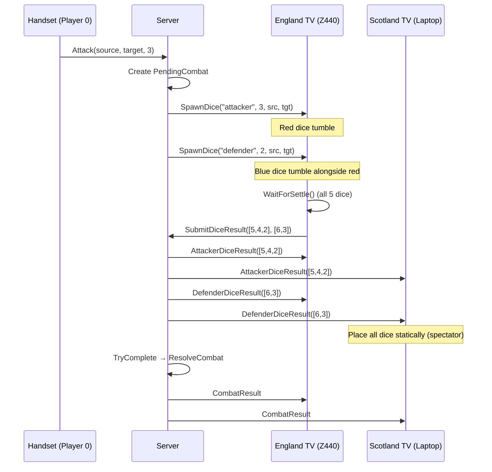
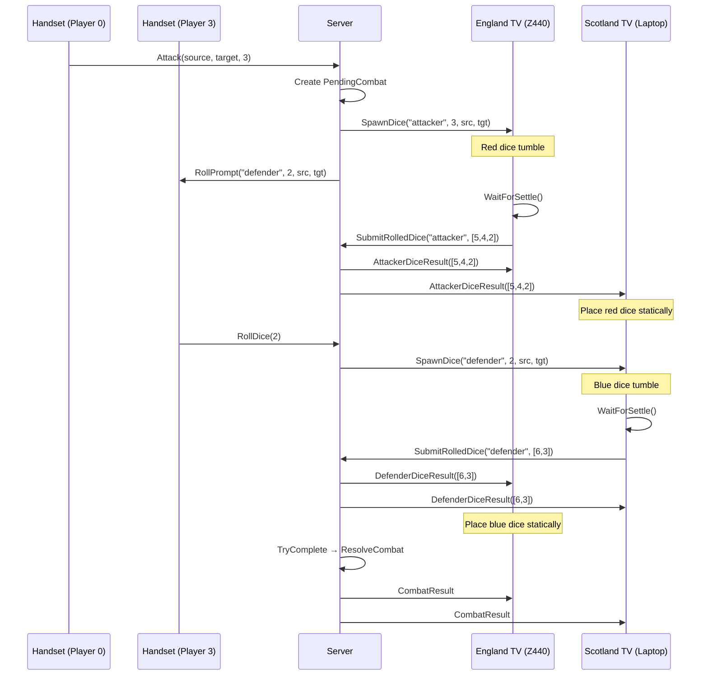

# Multi-Household Dice Flow

## Scenario 1 — Human (England) attacks Bot (Scotland)

Player 0 on England TV attacks Bot 2 on Scotland TV.



## Scenario 2 — Bot (Scotland) attacks Human (England)

Bot 2 on Scotland TV attacks Player 0 on England TV.



## Scenario 3 — Same-household combat (Player 0 attacks Bot 1, both England)

Both players belong to England TV. Scotland TV is spectator.



## Scenario 4 — Human (England) attacks Human (Scotland)

Player 0 attacks Player 3. Defender must tap Roll on handset.



## Key Principle

**Defender SpawnDice must wait for attacker to submit.** The server should NOT send `SpawnDice("defender")` until `SubmitRolledDice("attacker")` has arrived. This ensures:

1. Attacker dice are visible (statically) on defender's TV before defender rolls
2. No race condition where both TVs submit simultaneously and timeout fires
3. Matches the real board game feel — attacker rolls, reveals, THEN defender rolls

## Current Bug

The server sends both `SpawnDice` calls immediately in `PlayerRoll` + `AutoRollBotOpponent`. Both TVs start physics simultaneously. If defender settles before attacker submits, the `PendingCombat` may not have attacker dice yet — or worse, the arena display is confused.

## Required Server Change

`AutoRollBotOpponent("defender")` should NOT fire immediately. Instead, defender spawn should be triggered AFTER `SubmitRolledDice("attacker")` arrives:

```
AttackWithDice:
  1. Create PendingCombat
  2. PlayerRoll(attacker) → SpawnDice("attacker") to attacker TV
  3. Wait for SubmitRolledDice("attacker") ← NEW WAIT POINT
  4. THEN SpawnDice("defender") to defender TV (or RollPrompt if human)
  5. Wait for SubmitRolledDice("defender")
  6. TryComplete → ResolveCombat
```

---

*Created: 2026-07-07*
