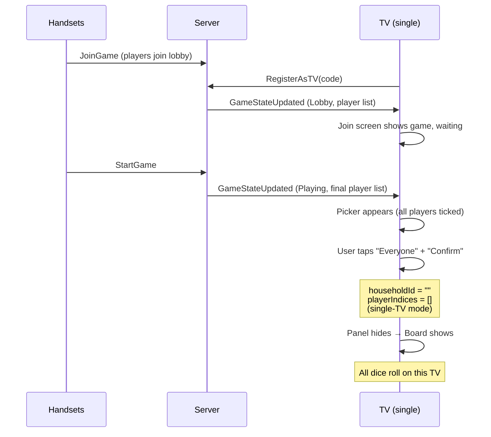
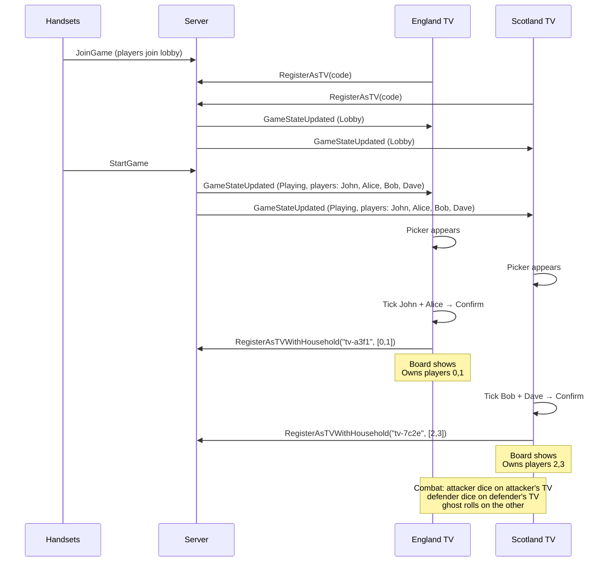

# TV Join & Household Picker Flow

## Scenario 1: Single TV (one room)

## Scenario 2: Multi-TV (two rooms)

## Key Points

- Picker shows on transition OUT of Lobby (player list is final)
- Single-TV: "Everyone" → no household config → all dice here
- Multi-TV: each TV picks its subset → re-registers with household → split dice routing
- Board only shows after Confirm (not before)
- Both TVs confirm independently — no coordination needed
